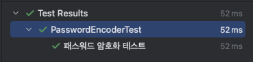

필수 기능
1. 선행조건
- application.properties
  - spring.jpa.hibernate.ddl-auto=create 설정
  - spring.jpa.generate-ddl=true 설정
  - 개인정보 담긴 파일은 .env파일에 담아 .gitignore에 추가
2. Transactional
 - createReservation 메서드 위에 @Transactional 추가해서 로직 수행 중간에 에러가 날 경우 롤백되도록 하였다.

3. 인가
 - interceptor를 사용하여 요청에 controller에 도달하기 전에 사용자 접근을 필터링하였다.
 - webconfig 클래스와 interceptor 클래스 사용

4. N+1 해결
 - 예약 조회시 연결되어 있는 사용자와 물건의 정보를 같이 가져오기 위해 select문이 한번씩 더 생기는 문제를 해결하기 위하여 ReservationRepository 인터페이스에 findAll 메서드를 오버라이드 하여 가져온 뒤 @Query를 사용하여 join fech를 걸어주었다.

5. QueryDSL 활용
 - 데이터 존재 여부에 따라 다른 JPA가 각각 호출되고 있는 기존의 코드를 Query DSL를 활용하여 동적 쿼리를 적용해보았다.
 - ReservationRepositoryQuery 인터페이스와 ReservationRepositoryQueryImpl 인터페이스를 추가하고 eservationRepositoryQueryImpl 인터페이스에 쿼리를 작성하였다.

6. DynamicInsert
 - Item 엔티티에 @DynamicInsert를 추가하여 Column 'status' cannot be null 에러를 해결하였다.
 - *item status를 reservation status와 연동하여 reservatoin status 변동시 자동으로 함께 변동 시키고 싶었으나 이부분은 구현하지 못하였다.

7. DB 접근 최소화
 - 2차 캐시를 이용하여 DB접근을 최소화하였다.
 - application.properties에 spring.cache.jcache.config=classpath:ehcache.xml를 추가하고
 - AdminService_reportUser 메소드 위에 @Cacheable(value = "adminCache", key ="#userIds")를 추가하는 방식으로 2차캐시방식을 구현하였다.
8. 리팩토링
 - updateReservationStatus에서 과다하게 사용되는 if-else문을 switch문으로 바꾸어서 else 구문을 걷어내주었다.
 - 컨트롤러에서 updateReservationStatus의 응답을 void에서 ResponseEntity<CommonResponse<Void>> 로 바꿔주고, 상태변경 성공시 성공 메세지를 응답하도록 설정하였다.
 - findById의 중복 사용을 해결하기 위해 각각의 Repository에 default메소드를 선언하여 중복을 줄여주었다.
 - updateReservationStatus의 상태값을 enum으로 관리하도록 기존의 String 코드를 변경해주었다.

9. 테스트 코드
 - PasswordEncoder 단위 테스트
   - @Test 를 사용해서 PasswordEncoder에 존재하는 메서드들에 대해서 “단위 테스트” 를 추가해주었다.
   
   - 
   - 패스워드 암호와 테스트가 정상적으로 진행되었다.
 -  *Item Entity에서 status 값이 nullable = false 이므로 해당 제약 조건이 동작하는지 테스트하는 코드는 구현하지 못하였다.